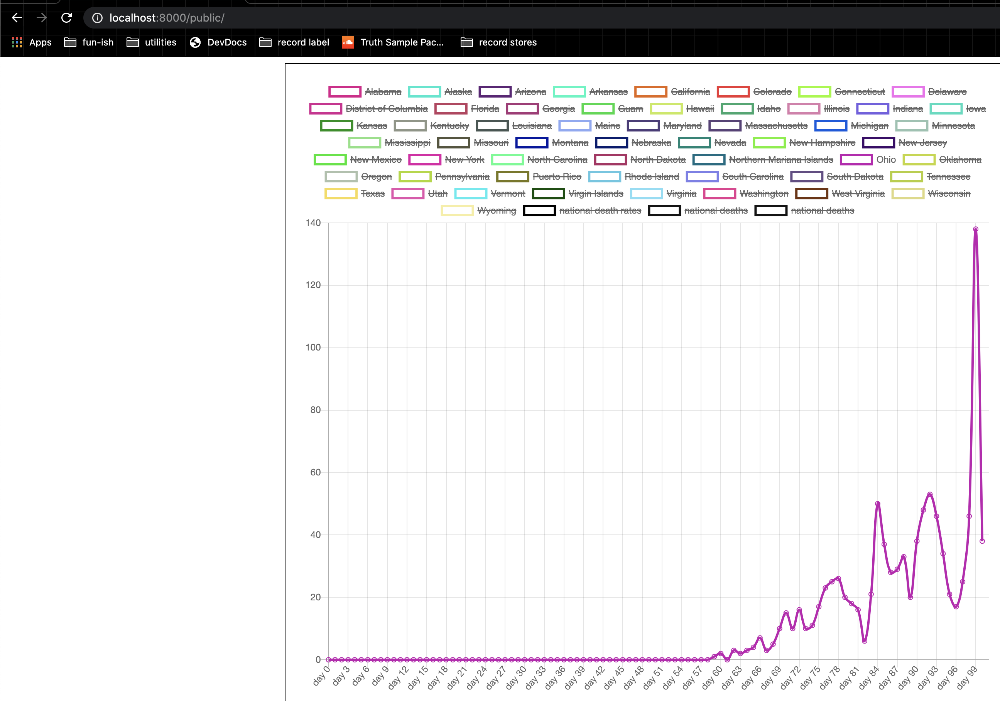
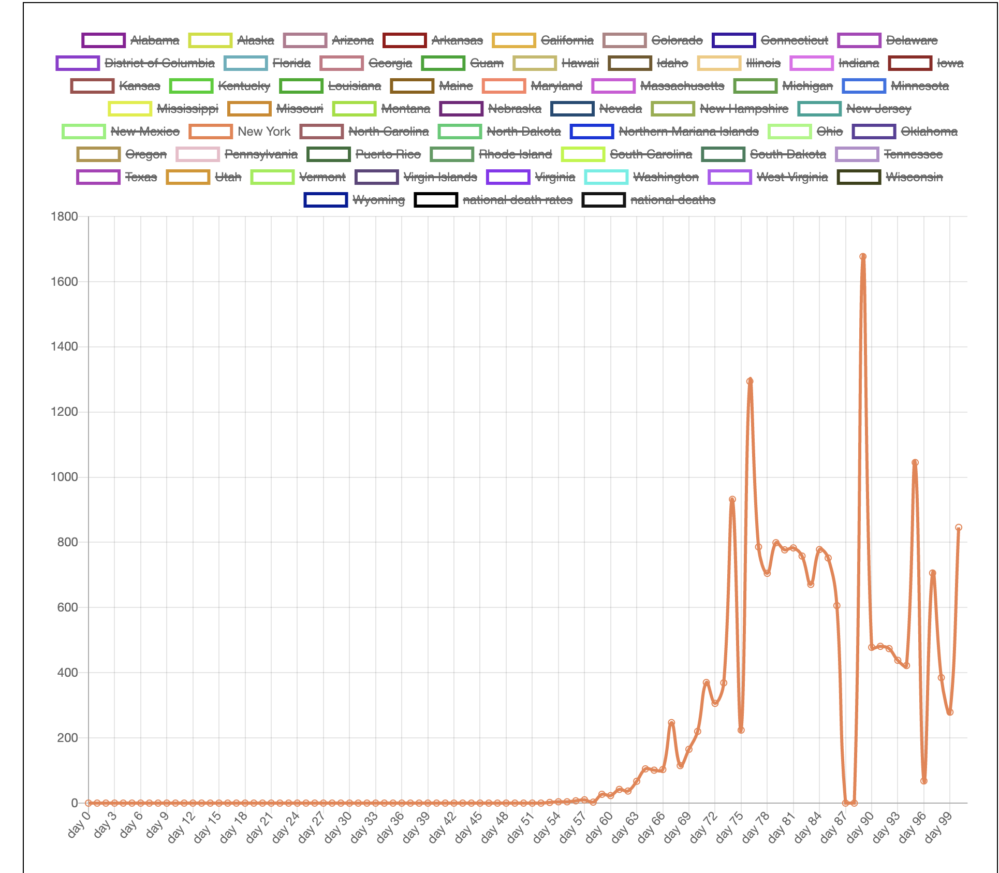

# Covid Differential Grapher

I got bored and got sick of reading headlines and shit of how bad the epidemic is, so I wrote a program that uses the 
NYTimes' publically available database so I could see the changes over time.

This is for the US only because reasons. This uses their breakdown by county/FIPS and I had to do some funky conversions 
because there are places in their data where they don't have an FIPS listed for one reason or another- where that happens
I convert their empty data into the format "${county}(if known; most times it translates to "Unknown") ${state}".


# How to install
If you're here you prolly know the deal, but if all this is new to you, cd into the directory where you want to install this and 

1. run ```git clone https://github.com/andrew-luhring/covid-differential-grapher.git```
1. cd into the ```covid-differential-grapher/``` directory
1. run ```git submodule init``` to initialize the data submodule (nytimes data) 
1. run ```git submodule update``` to grab the latest version of the data
1. now you have the data, and need to process it. Read on 

# How to process the data for the charts

I'm not a python dev so I don't know how to set up python stuff so you can just do ```python ./``` or whatever so in order
to run this you have to: 
1. cd into the ```bin/``` directory and run  ``` python __init__.py```
    1. this uses python3 so if that fails try
    1. ``` python3 __init__.py```
    1. and if that fails... idk. Install python 3 and run it with that.
1. After you run that (and it may take a second because I didn't spend a ton of time trying to figure out how to reduce the
time/space complexity or whatever) it should output a data.json file with a bunch of stuff in it.
1. Now you just gotta move that data.json to the right place: ```mv data.json ../public/js/```
1. And now just go to the public directory ```cd ../public/```

# How to see the charts and stuff

1. Start a server ```python -m http.server```
1. Open a browser and go to [http://localhost:8000](http://0.0.0.0:8000/)

If any of that failed and you know me personally message me.
If any of that failed and you don't know me personally you're on your own.


# What you'll see
Here's Ohio.



# Ya ok but what's it mean and why

Case reporting has been shitty and testing people when they're alive has been kinda not consistent. Death reporting tho... that IS consistent... at least more consistent. And easier to do. So rather than worrying about how many cases there are and trying to somehow discount errorneous reporting and stuff, it makes sense to me to look at death rates rather than case rates. 

Instead of tracking the death toll, which is just going to go up at over time and look big and scary on a graph, to me it made more sense to look at the CHANGES in death RATES over time. So when you see in the graph:

1,2,4,8

It doesn't mean 8 deaths at the end. It means 15. We're looking at the rate of change here not the death toll. The death rate from the first day to the second day was 1, from second to third it was 2, from third to fourth it was 4, from fourth to fifth it was 8; that's an exponential death rate increase.

"But But Andy, why does the death rate spike increasingly harder in Ohio every 7 days"
IDFK man. Are churches still open in Ohio on Sundays? The data there is from Friday, 5.2 days before friday is sunday; the average time from first symptom to death is 14... so people who are dying on Friday showed their first symptoms 2 fridays ago, which means they were probably infected on Sunday.


I'm not a mathmatician, I don't care. This is just useful to me so I know when it's safe to go outside; spoiler alert: it isn't. [Stay the fuck home](https://www.youtube.com/watch?v=hNte2PlQc14)


# Details
One thing I noticed, and you will too if you look at new york:



is that for some reason on day 87 and 88 the death rate miraculously drops to zero... meaning it is the exact same from the previous day... 2 days in a row. I have no idea why that happens. It could be my data processing but I think it's more likely they either ran out of tests or there's missing data. I remember that being a thing at some point but who even really knows. I'll ask the nytimes i guess
